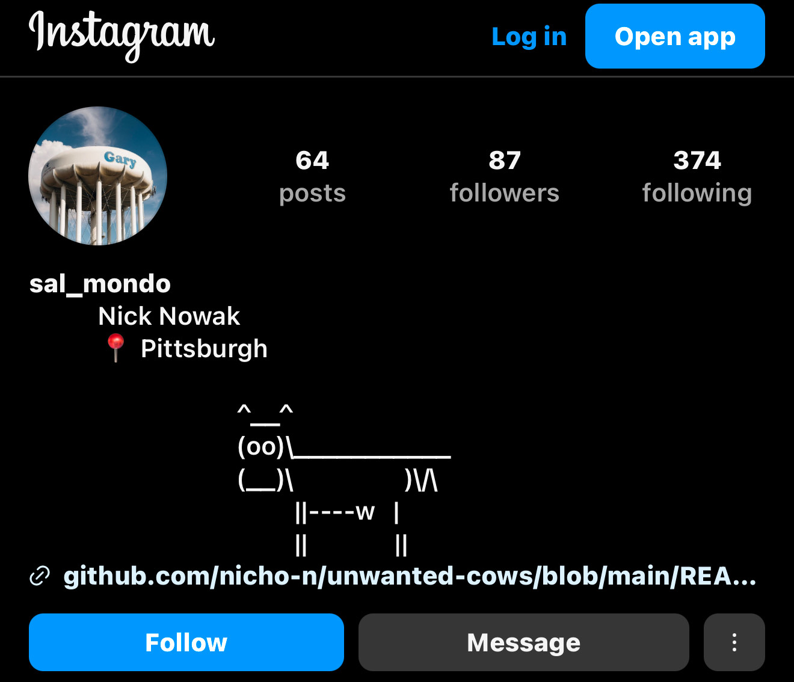

[Form is emptiness! Emptiness is form!](https://www.lionsroar.com/heart-sutra-fullness-emptiness/?fbclid=PAZXh0bgNhZW0CMTEAAaY2u3C6dgAIRaX6s6XqgIbdcel4NCBbCEi8rUCKP1lojyvXs4MXPmXh9-o_aem_p3-7qujV6kJvEgaTiBX0Qg)

A simple script which replaces the space character with [U+2800](https://www.compart.com/en/unicode/U+2800).

U+2800 is a far more exciting version of The Space, allowing us to input nothing when something is required.

In simpler terms, this allows you to bypass filtering done by most websites. You can insert art in a textbox that's just expecting normal text this way.

For ascii art, use [cowsay](https://cowsay-svelte.vercel.app/)

