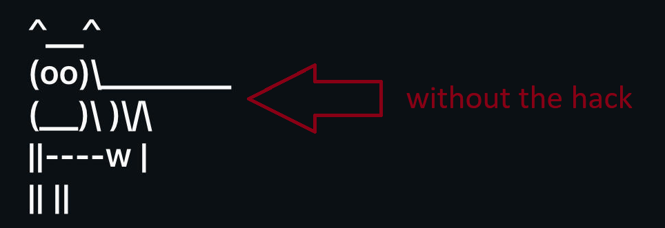

This is a simple script which replaces the whitespace character ("spacebar") with [U+2800](https://www.compart.com/en/unicode/U+2800), enabling the insertion of [ASCII art](https://en.wikipedia.org/wiki/ASCII_art) in unusual places, such as textboxes on LinkedIn, Facebook, and Instagram. A crudely drawn cow is shown below:

</img>

[U+2800](https://www.compart.com/en/unicode/U+2800) is a more exciting version of the whitespace character ("spacebar"), since it bypasses the filtering done by most websites. It's also known as Braille Pattern Blank.

A non-technical way of describing the effect is with [a classic Buddhist metaphor from Thich Naht Hahn](https://www.lionsroar.com/heart-sutra-fullness-emptiness/?fbclid=PAZXh0bgNhZW0CMTEAAaY2u3C6dgAIRaX6s6XqgIbdcel4NCBbCEi8rUCKP1lojyvXs4MXPmXh9-o_aem_p3-7qujV6kJvEgaTiBX0Qg):

- "If I am holding a cup of water and I ask you, “Is this cup empty?” you will say, “No, it is full of water.” But if I pour out the water and ask you again, you may say, “Yes, it is empty.” But empty of what? Empty means empty of something. The cup cannot be empty of nothing. “Empty” doesn’t mean anything unless you know “empty of what?” My cup is empty of water, but it is not empty of air."

In other words, without replacing the leading spaces with U+2800 in the ASCII Art, my cows wont work on these websites. Because the whitespace is comprised of air and not water!

</img>

For ascii art, use [cowsay](https://cowsay-svelte.vercel.app/).
